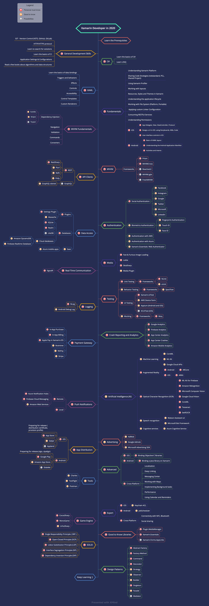

# Xamarin-Developer-Roadmap

Roadmap to becoming a Xamarin developer in 2020

> Roadmap to becoming an [Xamarin](https://docs.microsoft.com/en-us/xamarin/) developer in 2020:

Below you can find a chart demonstrating the paths that you can take and the libraries that you would want to learn to become a Xamarin developer. I made this chart as a tip for everyone who asks me, "What should I learn next as a Xamarin developer?"

## Disclaimer

> The purpose of this roadmap is to give you an idea about the landscape. The road map will guide you if you are confused about what to learn next, rather than encouraging you to pick what is hip and trendy. You should grow some understanding of why one tool would be better suited for some cases than the other and remember hip and trendy does not always mean best suited for the job

## Give a Star! :star:

If you like or are using this project to learn or start your solution, please give it a star. Thanks!

## Roadmap

## Resources

1. Prerequisites

   - [C#](https://www.pluralsight.com/paths/csharp)

2. General Development Skills

   - Learn GIT, create a few repositories on GitHub, share your code with other people
   - Know HTTP(S) protocol, request methods (GET, POST, PUT, PATCH, DELETE, OPTIONS)
   - Don't be afraid of using Google, [Power Searching with Google](http://www.powersearchingwithgoogle.com/)
   - Learn the basics of CI
   - Application Settings & Configurations
   - Read a few books about algorithms and data structures.

3. XAML

    - [Data bindings](https://www.tutorialspoint.com/xaml/xaml_data_binding.htm)
    - [Triggers](https://www.tutorialspoint.com/xaml/xaml_triggers.htm)
    - [Behaviors](https://docs.microsoft.com/en-us/xamarin/xamarin-forms/app-fundamentals/behaviors/)
    - [Effects](https://docs.microsoft.com/en-us/xamarin/xamarin-forms/app-fundamentals/effects/creating)
    - [Controls](https://www.tutorialspoint.com/xaml/xaml_controls.htm)
    - [Accessibility](https://docs.microsoft.com/en-us/xamarin/xamarin-forms/app-fundamentals/accessibility/)
    - [Control Templates](https://www.tutorialspoint.com/xaml/xaml_templates.htm)
    - [Custom Renderers](https://docs.microsoft.com/en-gb/xamarin/xamarin-forms/app-fundamentals/custom-renderer/)

4. Fundamentals

    - [Understanding Xamarin Platform](https://docs.microsoft.com/en-gb/xamarin/get-started/what-is-xamarin)
    - [Sharing code overview](https://docs.microsoft.com/en-gb/xamarin/cross-platform/app-fundamentals/code-sharing)
    - [Async / Await in Xamarin](https://devblogs.microsoft.com/xamarin/getting-started-with-async-await/)
    - [Linking Xamarin.iOS Apps](https://docs.microsoft.com/en-gb/xamarin/ios/deploy-test/linker?tabs=macos)
    - [Linking on Android](https://docs.microsoft.com/en-gb/xamarin/android/deploy-test/linker)
    - [Cross-Platform File IO for iOS, Android](https://devblogs.microsoft.com/xamarin/simple-cross-platform-file-io-for-ios-android-and-windows/)
    - [Consuming RESTful Services](https://docs.microsoft.com/en-us/xamarin/xamarin-forms/data-cloud/web-services/rest)
    - [App Lifecycle](https://docs.microsoft.com/en-gb/xamarin/xamarin-forms/app-fundamentals/app-lifecycle)
    - [Working with layouts](https://docs.microsoft.com/en-us/xamarin/xamarin-forms/user-interface/controls/layouts)
    1. Android
        - [Basic of AXML layout](https://docs.microsoft.com/en-us/xamarin/android/user-interface/android-designer/designer-basics?tabs=windows)
        - [Understanding the Android Application Manifest](https://docs.microsoft.com/en-gb/xamarin/android/platform/android-manifest)
        - [Activities and Intents]
    2. iOS
        - [Understanding of iOS Terms: App Delegate, View, ViewController, Protocol]
        - [Design a UI in iOS: using Storyboards, NIBs, Code](https://docs.microsoft.com/en-us/xamarin/ios/user-interface/ios-ui/creating-ui-objects?tabs=macos)

5. [MVVM Fundamentals](https://docs.microsoft.com/en-gb/xamarin/xamarin-forms/enterprise-application-patterns/mvvm)

    - [Dependency Injection](https://docs.microsoft.com/en-gb/xamarin/xamarin-forms/enterprise-application-patterns/dependency-injection)
        - [Autofac](https://autofac.org/) is an addictive Inversion of Control container for .NET Core, ASP.NET Core, .NET.
        - [Ninject](http://www.ninject.org/) is a lightning-fast, ultra-lightweight dependency injector for .NET applications.
        - [TinyIoC](https://github.com/grumpydev/TinyIoC) an easy to use, hassle free, Inversion of Control Container.
    - [Navigation](https://docs.microsoft.com/en-gb/xamarin/xamarin-forms/enterprise-application-patterns/navigation)
    - [Commands](https://docs.microsoft.com/en-us/xamarin/xamarin-forms/app-fundamentals/data-binding/commanding)
    - [Converters](https://docs.microsoft.com/en-us/xamarin/xamarin-forms/app-fundamentals/data-binding/converters)
    - [Validation](https://docs.microsoft.com/en-gb/xamarin/xamarin-forms/enterprise-application-patterns/validation)

6. MVVM frameworks

    - [Prism](https://github.com/PrismLibrary/Prism)
    - [MVVMCross](https://www.mvvmcross.com/)
    - [MVVMLight](http://www.mvvmlight.net/)
    - [FreshMVVM](https://github.com/rid00z/FreshMvvm)
    - [ReactiveUI](https://reactiveui.net/) – if you are doing Rx
    - [Fabulous MVU](https://fsprojects.github.io/Fabulous/Fabulous.XamarinForms/) F# Functional App Development, using declarative dynamic UI

7. API Clients

    1. REST
        - [RestSharp](http://restsharp.org/)
        - [ModernHttpClient](https://github.com/paulcbetts/ModernHttpClient) - Accelerates HTTP requests by using mobile-optimized libs (NSURLSession / OkHttp).
        - [Refit](https://github.com/reactiveui/refit): The automatic type-safe REST library for Xamarin and .NET.
        - [Polly](https://github.com/App-vNext/Polly): Automatic retry policies. Exception handling policies such as Retry, Retry Forever, Wait and Retry or Circuit Breaker.
    2. GraphQL
        - [GraphQL-dotnet](https://github.com/graphql-dotnet/graphql-client)

8. Data Access

    1. Databases
        - [SQLite](https://docs.microsoft.com/en-gb/xamarin/android/data-cloud/data-access/using-sqlite-orm)
        - [Realm](https://realm.io/docs/dotnet/latest)
        - [LiteDB](https://www.litedb.org/) A .NET NoSQL Document Store in a single data file.
    2. Plugins
        - [Settings Plugin](https://github.com/jamesmontemagno/SettingsPlugin)
        - [Akavache](https://github.com/reactiveui/Akavache)
    3. ORM
        - [SQLite-Net.PCL](https://github.com/praeclarum/sqlite-net)
        - [EntityFramework Core](https://xamarinhelp.com/entity-framework-core-xamarin-forms/)
    4. PaaS
        - [Azure mobile apps](https://docs.microsoft.com/en-us/previous-versions/azure/app-service-mobile/app-service-mobile-value-prop) Offline sync-enabled Xamarin apps that connect to Azure Mobile App.
    5. Cloud databases
        - [Firebase Realtime Database](https://firebase.google.com/docs/database)
        - [Amazon DynamoDB](https://docs.aws.amazon.com/mobile/sdkforxamarin/developerguide/dynamodb.html) is a fast, highly scalable non-relational database service. DynamoDB removes traditional scalability limitations on data storage while maintaining low latency and predictable performance.

9. Authentication

    - Biometrics Authentication
            - [Fingerprint Authentication](https://docs.microsoft.com/en-us/xamarin/android/platform/fingerprint-authentication/)
            - [Touch ID](https://docs.microsoft.com/en-us/xamarin/ios/platform/touch-id-face-id)
            - [Face ID](https://docs.microsoft.com/en-us/samples/xamarin/ios-samples/ios11-faceidsample/)
    - [Social Authentication](https://devblogs.microsoft.com/xamarin/authentication-xamarin-essentials-aspnet/)
        - [Facebook](https://www.xamboy.com/2019/07/23/social-media-authentication-facebook-login-in-xamarin-forms/)
        - [Instagram](https://www.xamboy.com/2019/08/02/social-media-authentication-instagram-login-in-xamarin-forms/)
        - [Google](https://www.xamboy.com/2019/11/19/social-media-authentication-google-login-in-xamarin-forms/)
        - [Twitter](https://channel9.msdn.com/Blogs/MVP-Azure/Implementing-OAuth-with-Twitter-in-an-empty-Xamarin-Forms-Android-Application)
        - [Microsoft](https://docs.microsoft.com/en-us/azure/active-directory/develop/msal-net-use-brokers-with-xamarin-apps)
        - [LinkedIn](https://github.com/HoussemDellai/Xamarin.Auth)
    - [Sign in with Apple](https://www.xamboy.com/2020/01/13/rendy-delrosariogmail-com/)
    - [Authentication with AWS](https://docs.aws.amazon.com/mobile/sdkforxamarin/developerguide/setup.html)
    - [Authentication with Azure](https://docs.microsoft.com/en-us/previous-versions/azure/app-service-mobile/app-service-mobile-auth)
    - [Xamarin.Essentials: Web Authenticator](https://docs.microsoft.com/en-us/xamarin/essentials/web-authenticator?tabs=android)

10. Media

    - [Lottie](https://xamgirl.com/lottie-animations-step-by-step-in-xamarin-forms/) is a mobile library for Android and iOS that natively renders vector based animations and art in realtime with minimal code.
    - [Fast & Furious Image Loading](https://github.com/luberda-molinet/FFImageLoading) Image loading, caching & transforming library for Xamarin and Windows
    - [SkiaSharp](https://docs.microsoft.com/en-gb/xamarin/xamarin-forms/user-interface/graphics/skiasharp/)
    - [Media Plugin](https://github.com/jamesmontemagno/MediaPlugin) cross platform plugin to take photos and video or pick them from a gallery from shared code.

11. Real-Time Communication

    - [SignalR](https://docs.microsoft.com/en-us/xamarin/xamarin-forms/data-cloud/azure-services/azure-signalr) allows server code to send asynchronous notifications to client-side applications.

12. Logging

    - [NLog](https://damienaicheh.github.io/xamarin/nlog/2019/06/06/monitor-your-xamarin-application-using-nlog-en.html)
    - [Android Debug Log](https://docs.microsoft.com/en-us/xamarin/android/deploy-test/debugging/android-debug-log?tabs=windows)

13. Testing

    1. [Unit Testing](http://blog.stevensanderson.com/2009/08/24/writing-great-unit-tests-best-and-worst-practises/)
        1. Frameworks
            - [xUnit](https://gregshackles.com/testing-xamarin-apps-getting-started-with-xunit/)
            - [NUnit](https://docs.microsoft.com/en-gb/xamarin/ios/deploy-test/touch.unit)
    2. Behavior Testing
        1. Frameworks
            - [SpecFlow](https://robgibbens.com/bdd-tests-with-xamarin-uitest-and-specflow/) is a pragmatic BDD solution for .NET. It uses the Gherkin specification language.
    3. UI Testing
        - [Xamarin.UITest](https://docs.microsoft.com/en-us/appcenter/test-cloud/uitest/)
        - [Cloud testing on AWS Device Farm](https://aws.amazon.com/ru/device-farm/)
        - [Firebase Test Lab](https://firebase.google.com/docs/test-lab) is a cloud-based app-testing infrastructure.
        - [Appium](http://appium.io/)
        - [XCUITest](http://appium.io/docs/en/drivers/ios-xcuitest/)
    4. Mocking
        1. Frameworks
         - [Moq](https://github.com/moq/moq4)

14. Crash Reporting and Analytics

    - [Google Analytics](https://xamarinhelp.com/google-analytics-xamarin/)
    - [App Center Analytics](https://docs.microsoft.com/en-us/appcenter/sdk/analytics/xamarin)
    - [App Center Crashes](https://docs.microsoft.com/en-us/appcenter/sdk/crashes/xamarin)
    - [Firebase Analytics](https://www.thewissen.io/using-firebase-analytics-in-your-xamarin-forms-app/)
    - [Amazon Mobile Analytics](https://docs.aws.amazon.com/mobile/sdkforxamarin/developerguide/analytics.html)

15. Payment Gateway

    - [In-App Purchase](https://docs.microsoft.com/en-us/xamarin/ios/platform/in-app-purchasing/) iOS
    - [In-App Billing](https://devblogs.microsoft.com/xamarin/integrating-in-app-purchases-in-mobile-apps/) Android
    - [Apple Pay in Xamarin.iOS](https://docs.microsoft.com/en-us/xamarin/ios/platform/apple-pay)
    - [Braintree](https://www.xamboy.com/category/payments/braintree/) is a simple and modern way to accept payments. Along with its list of flexible features, it provides the ability to merchants to accept payments online or within a mobile application.
        - Pay with Credit Cards
        - Pay with Apple Pay/Google Pay
        - Pay with Paypal
    - [WePay](https://www.xamboy.com/category/payments/wepay/) is an online payment service provider based in the United States that provides an integrated and customizable payment solution through its APIs to platform businesses such as crowdfunding sites, marketplaces, and small business software companies. It offers partners fraud and risk protection
    - [Stripe](https://xamarinhelp.com/stripe-in-xamarin/) online payment processing for internet businesses

16. Push Notifications

    1. Remote
        - [Azure Notification Hubs](https://docs.microsoft.com/en-us/azure/notification-hubs/notification-hubs-push-notification-overview)
        - [Firebase Cloud Messaging](https://firebase.google.com/docs/cloud-messaging)
            - [Firebase Cloud Messaging on Android and iOS with Xamarin](https://docs.microsoft.com/en-us/xamarin/android/data-cloud/google-messaging/firebase-cloud-messaging)
        - [Amazon Web Services](https://docs.aws.amazon.com/mobile/sdkforxamarin/developerguide/sns.html)
            - [Xamarin iOS](https://docs.aws.amazon.com/mobile/sdkforxamarin/developerguide/getting-started-sns-ios.html)
            - [Xamarin Android](https://docs.aws.amazon.com/mobile/sdkforxamarin/developerguide/getting-started-sns-android.html)
    2. [Local](https://docs.microsoft.com/en-us/xamarin/xamarin-forms/app-fundamentals/local-notifications)

17. Artificial Intelligence (AI)

    1. Machine Learning
        - [CoreML](https://developer.apple.com/documentation/coreml)
        - [ML Kit](https://developers.google.com/ml-kit)
        - [Google Cloud APIs](https://cloud.google.com/apis)
    2. Augmented Reality
        1. Android
            - [ARCore](https://devblogs.microsoft.com/xamarin/augmented-reality-xamarin-android-arcore/)
        2. iOS
            - [ARKit](https://docs.microsoft.com/en-gb/xamarin/ios/platform/introduction-to-ios11/arkit/)
    3. Optical Character Recognition (OCR)
        - [ML Kit for Firebase](https://firebase.google.com/docs/ml-kit/)
        - [Amazon Rekognition](https://aws.amazon.com/ru/rekognition/)
        - [Microsoft Computer Vision](https://azure.microsoft.com/en-us/services/cognitive-services/computer-vision/)
        - [Google Cloud Vision](https://cloud.google.com/vision)
        - [CoreML](https://developer.apple.com/documentation/coreml)
        - [Tesseract](https://github.com/halkar/Tesseract.Xamarin)
        - [SwiftOCR](https://github.com/garnele007/SwiftOCR)
    4. Speech recognition
        - [Watson Assistant v2](https://cloud.ibm.com/apidocs/assistant/assistant-v2)
        - [Microsoft Bot Framework](https://www.botframework.com/)
    5. [Cognitive services](https://docs.microsoft.com/en-gb/xamarin/xamarin-forms/data-cloud/azure-cognitive-services/introduction)
        - [Azure Cognitive Service](https://azure.microsoft.com/en-us/services/cognitive-services/#overview)

18. Advertising

    - [AdMob](https://montemagno.com/xamarinforms-google-admob-ads-in-android/)
    - [Google Admob](https://admob.google.com/home/)
        - [iOS](https://montemagno.com/xamarinforms-google-admob-ads-in-ios/)
        - [Android](https://montemagno.com/xamarinforms-google-admob-ads-in-android/)
    - [Microsoft Advertising SDK](https://montemagno.com/xamarin-forms-uwp-ads/)

19. App Distribution

    1. Android
        - [Publishing an Application Android](https://docs.microsoft.com/en-gb/xamarin/android/deploy-test/publishing/)
        - [Publishing to Google Play](https://docs.microsoft.com/en-gb/xamarin/android/deploy-test/publishing/publishing-to-google-play/?tabs=windows)
        - [Publishing to the Amazon App Store](https://docs.microsoft.com/en-gb/xamarin/android/deploy-test/publishing/publishing-to-amazon)
        - [SlideMe](http://slideme.org/application/slideme-marketplace) a US-based Android mobile app store alternative.
    2. iOS
        - [Publishing to the App Store](https://docs.microsoft.com/en-gb/xamarin/ios/deploy-test/app-distribution/app-store-distribution/publishing-to-the-app-store?tabs=macos)
        - [GetJar](https://www.getjar.com/) is an independent app store created by app developers for app developers as an app beta testing platform.
        - [Appland](https://www.applandinc.com/) app store alternative if you’re trying to target end-users in international markets including Indonesia, Mexico, Oman, USA, Iran, El Salvador, Malaysia, Iraq, Bangladesh, Panama, Myanmar, Cambodia, Egypt, etc.
    3. [Alternative App Stores](https://www.mobileappdaily.com/app-stores-list)

20. Advanced

    1. Android
        - [Binding a Java Library](https://docs.microsoft.com/en-gb/xamarin/android/platform/binding-java-library/)
    2. iOS
        - [Binding Objective-C Libraries](https://developer.xamarin.com/guides/cross-platform/macios/binding/)
    3. Cross-Platform
        - [Application Indexing and Deep Linking](https://docs.microsoft.com/en-us/xamarin/xamarin-forms/app-fundamentals/deep-linking)
        - [Localization](https://docs.microsoft.com/en-gb/xamarin/xamarin-forms/app-fundamentals/localization/)
        - [Deep Linking](https://docs.microsoft.com/en-gb/xamarin/android/platform/app-linking)
        - [Improve App Performance](https://docs.microsoft.com/en-us/xamarin/xamarin-forms/deploy-test/performance)

21. Tools

    - [Charles](https://www.charlesproxy.com/) is an HTTP proxy / HTTP monitor / Reverse Proxy that enables viewing of all the HTTP and SSL / HTTPS traffic between the machine and the Internet.
    - [TestFlight](https://docs.microsoft.com/en-gb/xamarin/ios/deploy-test/testflight?tabs=macos) is Apple’s beta testing service for iOS apps, and is accessible only through iTunes Connect.
    - [Postman](https://www.postman.com/) Tool for test web services requests and responses.

22. Expert

    1. Android
        - [JobScheduler](https://developer.android.com/guide/background) is an API for scheduling various types of jobs against the framework that will be executed in your application's own process.
    2. iOS
        - [Keychain ACL](https://developer.apple.com/documentation/security/keychain_services/keychain_items/sharing_access_to_keychain_items_among_a_collection_of_apps)

    - [Social sharing](https://ilanolkies.com/post/Xamarin-social-sharing)
    - [Connectivity with NFC, Bluetooth](https://docs.microsoft.com/en-us/xamarin/ios/platform/introduction-to-ios11/corenfc)

23. Game Engine

    - [MonoGame](https://docs.microsoft.com/en-us/xamarin/graphics-games/monogame/) is a free C# framework used by game developers to make games for multiple platforms and other systems.
    - [CocosSharp](https://github.com/xamarin/docs-archive/blob/master/Docs/CocosSharp/index.md) is a C# implementation of the Cocos2D and Cocos3D APIs that runs on any platform where MonoGame runs.
    - [UrhoSharp](https://docs.microsoft.com/en-gb/xamarin/graphics-games/urhosharp/) is a powerful 3D Game Engine for Xamarin and .NET developers.

24. Good to Know

    - [Plugin.MediaManager](https://github.com/Baseflow/XamarinMediaManager) Cross platform Xamarin plugin to play and control Audio and Video.
    - [Xamarin.Forms.AppLinks](https://www.nuget.org/packages/Xamarin.Forms.AppLinks) Add support for deep linking and indexing app content using Xamarin.Forms on the Android Platform.
    - [Snppts](https://snppts.dev/) Xamarin Forms UI Snippets.

25. SOLID

    - [Single Responsibility Principle (SRP)](https://www.dotnetcurry.com/software-gardening/1148/solid-single-responsibility-principle)
    - [Open-Closed Principle (OCP)](https://www.dotnetcurry.com/software-gardening/1176/solid-open-closed-principle)
    - [Liskov Substitution Principle (LSP)](https://www.dotnetcurry.com/software-gardening/1235/liskov-substitution-principle-lsp-solid-patterns)
    - [Interface Segregation Principle (ISP)](https://www.dotnetcurry.com/software-gardening/1257/interface-segregation-principle-isp-solid-principle)
    - [Dependency Inversion Principle (DIP)](https://www.dotnetcurry.com/software-gardening/1284/dependency-injection-solid-principles)

26. Design-Patterns

    - [Abstract Factory](https://www.dofactory.com/net/abstract-factory-design-pattern)
    - [Factory Method](https://www.dofactory.com/net/factory-method-design-pattern)
    - [Command](https://www.dofactory.com/net/command-design-pattern)
    - [Decorator](https://www.dofactory.com/net/decorator-design-pattern)
    - [Strategy](https://www.dofactory.com/net/strategy-design-pattern)
    - [Observer](https://www.dofactory.com/net/observer-design-pattern)
    - [Builder](https://www.dofactory.com/net/builder-design-pattern)
    - [Singleton](https://www.dofactory.com/net/singleton-design-pattern)
    - [Facade](https://www.dofactory.com/net/facade-design-pattern)
    - [Mediator](https://www.dofactory.com/net/mediator-design-pattern)

## Wrap Ups

If you think the roadmap can be improved, please do open a PR with any updates and submit any issues. Also, I will continue to improve this, so you might want to star this repository to revisit.

Idea from : [ASP.NET Core Developer Roadmap](https://github.com/MoienTajik/AspNetCore-Developer-Roadmap)

## Contribution

Want to contribute? We encourage community feedback and contributions. Please follow our [contributing guidelines](https://github.com/Stayrony/Xamarin-Developer-Roadmap/blob/master/CONTRIBUTING.md).

## License

